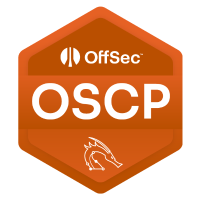
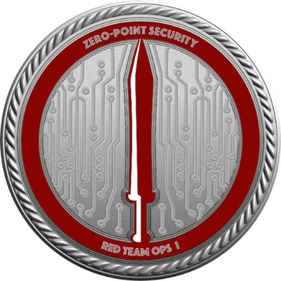
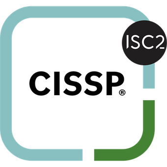
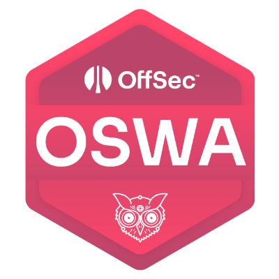
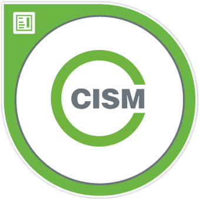
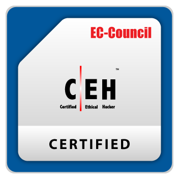

## Hey! 👋 My name is Asif. I am a passionate penetration tester exploring red-team techniques, learning offensive methods, pivoting and post-exploit workflows. 
In my free time I contribute to the community, report vulnerabilities through responsible disclosure, and publish CVEs for confirmed issues.

### Glad to see you here! &nbsp;

  

### Projects & Contributions:

  
<b> CVEs</b>

   
    <table>
      <thead align="center">
        <tr border: none;>
          <td><b>CVE</b></td>
          <td><b>Short Description</b></td>
          <td><b>References</b></td>
        </tr>
      </thead>
      <tbody>
       <tr>
  <td><b>WordPress security researcher CVEs overview</b></td>
  <td>An overview of the vulnerabilities I’ve reported and published through Wordfence Threat Intelligence, including CVE IDs, descriptions, and affected software.</td>
  <td><a href="https://www.wordfence.com/threat-intel/vulnerabilities/researchers/asif-nawaz-minhas?page=2" target="_blank" rel="noopener noreferrer">Wordfence Researcher Page</a></td>
</tr>
<tr>
  <td><b>CVE-2024-34955</b></td>
  <td>Code-projects Budget Management 1.0 is vulnerable to SQL Injection via the delete parameter.</td>
  <td><a href="https://nvd.nist.gov/vuln/detail/CVE-2024-34955" target="_blank" rel="noopener noreferrer">NVD Entry</a></td>
</tr>
<tr>
  <td><b>CVE-2024-34954</b></td>
  <td>Code-projects Budget Management 1.0 is vulnerable to Cross Site Scripting (XSS) via the budget parameter.</td>
  <td><a href="https://nvd.nist.gov/vuln/detail/CVE-2024-34954" target="_blank" rel="noopener noreferrer">NVD Entry</a></td>
</tr>
      </tbody>
    </table>
     

  
<b> Guides, etc</b>

   
    <table>
      <thead align="center">
        <tr border: none;>
          <td><b>Project</b></td>
          <td><b>Short Description</b></td>
          <td><b>Stars</b></td>
          <td><b>Forks</b></td>
        </tr>
      </thead>
      <tbody>
        <tr>
          <td><a href="https://genai.owasp.org/resource/genai-red-teaming-guide/" target="_blank" rel="noopener noreferrer"><b>OWASP GenAI Red Teaming Guide</b></a></td>
          <td>A community-driven guide by OWASP on red teaming for generative AI systems, outlining risks, testing approaches, and mitigation strategies.</td>
          <td>N/A</td>
          <td>N/A</td>
        </tr>
      </tbody>
    </table>

---

## About me

I’m an Offensive Security Engineer / Penetration Tester with a background from Royal Holloway, University of London. Born in the Netherlands 🇳🇱 and native in Dutch, I spend the majority of my time learning and practising hands-on offensive techniques, ethical hacking, responsible disclosure and publishing technical writeups on my blog.  

My work focuses on practical penetration testing, red-team skills: post-exploit pivoting, Active Directory escalation, AV/EDR evasion and real-world engagements. 

I balance professional consulting with continuous learning (CTFs, HTB labs, and research) and producing readable, writeups for the community.

### Quick facts
- **Education:** MSc Information Security (Royal Holloway, University of London); Bachelor in ICT: Information & Communication Technology (Windesheim University of Applied Sciences)  
- **Location / Languages:** Netherlands: born and raised; native Dutch 🇳🇱, fluent English 🇬🇧; conversational in Urdu/Hindi 🇵🇰 🇮🇳 and some Arabic 🇸🇦
- **Specialties:** Web hacking, red teaming, pivoting, AV/EDR evasion, escalation paths, exploit development, responsible disclosure  
- **Interests:** Purple teaming, adversary emulation, automated recon pipelines, threat-informed defense

You can reach me here 👇

  
  
  
  

---

##  Trophies

| OSCP | CRTO | CISSP | OSWA | CISM | CEH |
| :--: | :--: | :---: | :--: | :--: | :-: |
|  |  |  |  |  |  |

---

Feel free to give your suggestions 

