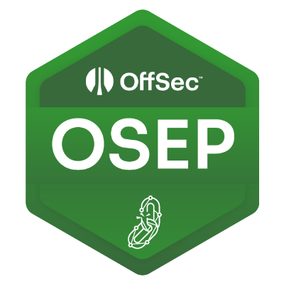
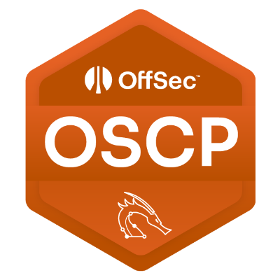
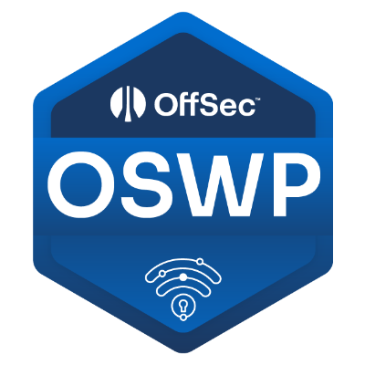
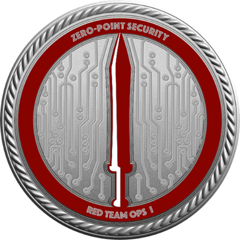
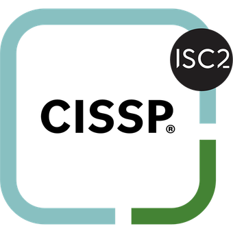
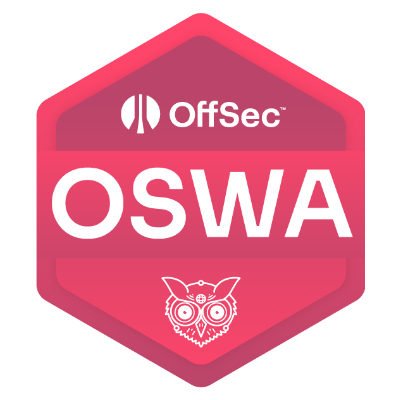
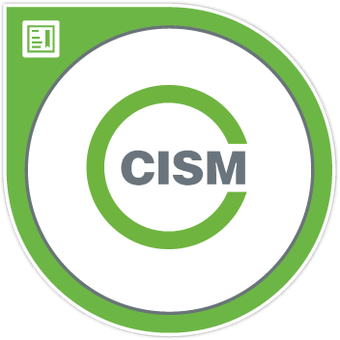

# Asif Nawaz Minhas

### Offensive Security Specialist

**Penetration Testing · Red Teaming · Vulnerability Research · Enterprise Security**

I am an Offensive Security Specialist focused on practical penetration testing, red teaming, vulnerability research and enterprise security.

My work spans web application security, Windows and Active Directory environments, infrastructure security and adversary simulation, with a focus on identifying high impact weaknesses and translating technical findings into meaningful security improvements.

I also contribute to responsible vulnerability disclosure, security research and community knowledge sharing, while exploring the growing role of AI in offensive security.

  
  
  
  
  

---

## Featured Security Projects

### Security Notes

**Practical cybersecurity, penetration testing, red teaming and vulnerability research notes.**

A growing knowledge base covering offensive security techniques, tools, methodologies and technical references.

**Website:**  
https://notes.asifnawazminhas.com/

**Repository:**  
https://github.com/asifnawazminhas/security-notes

---

### Offensive One Liners

**A practical collection of offensive security commands and one liners.**

A searchable reference covering penetration testing, Active Directory, web security, reconnaissance, red teaming, Windows, Linux and other offensive security workflows.

**Website:**  
https://oneliners.asifnawazminhas.com/

**Repository:**  
https://github.com/asifnawazminhas/awesome-offensive-oneliners

---

### AI for Security Professionals

**36 tools · 13 security native · 6 categories**

A focused directory of AI security tools and general purpose AI that can support authorised security research, penetration testing, autonomous penetration testing, red teaming, AppSec, LLM security, MCP security, vulnerability research, analysis and reporting.

**Website:**  
https://ai.asifnawazminhas.com/

---

### Security Studio

An interactive cybersecurity project focused on learning, experimentation and practical security knowledge.

**Website:**  
https://studio.asifnawazminhas.com/

---

### wwwtree-redteam

A red team focused project from my offensive security research and tooling work.

**Repository:**  
https://github.com/asifnawazminhas/wwwtree-redteam

---

### Professional Profile

A dedicated overview of my experience, certifications, research, vulnerability research and offensive security work.

**Website:**  
https://about.asifnawazminhas.com/

---

## Areas of Focus

  
  
  
  
  
  
  
  

My main areas of focus and research include:

- Penetration testing
- Red teaming and adversary simulation
- Web application security
- Windows security
- Active Directory security
- Infrastructure security
- Vulnerability research
- Responsible disclosure
- AV and EDR evasion research
- Post exploitation and pivoting
- Purple teaming
- AI assisted security testing
- LLM security
- MCP security
- Automated reconnaissance
- Security tooling and automation

---

## Vulnerability Research

I actively contribute to responsible vulnerability disclosure and vulnerability research.

My research includes hundreds of reported security issues and multiple published CVEs across different products and platforms.

### WordPress Security Research

An overview of vulnerabilities I have reported and published through Wordfence Threat Intelligence, including CVE identifiers, vulnerability descriptions and affected software:

**Wordfence Researcher Profile:**  
https://www.wordfence.com/threat-intel/vulnerabilities/researchers/asif-nawaz-minhas?page=2

### Selected CVEs

| CVE | Description | Reference |
| :--- | :--- | :--- |
| **CVE-2024-34955** | SQL Injection vulnerability in Code Projects Budget Management 1.0 via the `delete` parameter. | [NVD](https://nvd.nist.gov/vuln/detail/CVE-2024-34955) |
| **CVE-2024-34954** | Cross Site Scripting vulnerability in Code Projects Budget Management 1.0 via the `budget` parameter. | [NVD](https://nvd.nist.gov/vuln/detail/CVE-2024-34954) |
| **CVE-2025-54384** | Stored XSS vector in Markdown description fields. | [NVD](https://nvd.nist.gov/vuln/detail/CVE-2025-54384) · [GitHub Advisory](https://github.com/ckan/ckan/security/advisories/GHSA-2r4h-8jxv-w2j8) |

---

## Certifications

| OSEP | OSCP | OSWP | CRTO | CISSP | OSWA | CISM |
| :--: | :--: | :--: | :--: | :--: | :--: | :--: |
|  |  |  |  |  |  |  |

---

## Research & Community

### Purple Teaming

My academic research focuses on purple teaming, cybersecurity exercises, collaboration and knowledge transfer between offensive and defensive security teams.

The research explores how organisations can structure, implement and sustain effective purple teaming programmes and how collaborative security exercises can improve knowledge transfer and cyber resilience.

### OWASP GenAI Red Teaming Guide

Contributor to the community driven **OWASP GenAI Red Teaming Guide**, covering approaches, risks and methodologies for red teaming generative AI systems.

https://genai.owasp.org/resource/genai-red-teaming-guide/

### Responsible Disclosure

I regularly conduct responsible vulnerability research and report identified security issues through coordinated and responsible disclosure processes.

My research interests include:

- Web applications
- Authentication and authorisation
- Enterprise environments
- Infrastructure
- Active Directory
- Security misconfigurations
- AI enabled applications
- LLM security
- Emerging attack surfaces

---

## Education

**MSc Information Security**  
Royal Holloway, University of London

**Bachelor ICT: Information & Communication Technology**  
Windesheim University of Applied Sciences

---

## GitHub Activity

  

---

## Connect

  

  

  

  

  

  

  

  

---

### Build · Break · Research · Share

**Offensive Security · Red Teaming · Vulnerability Research**

